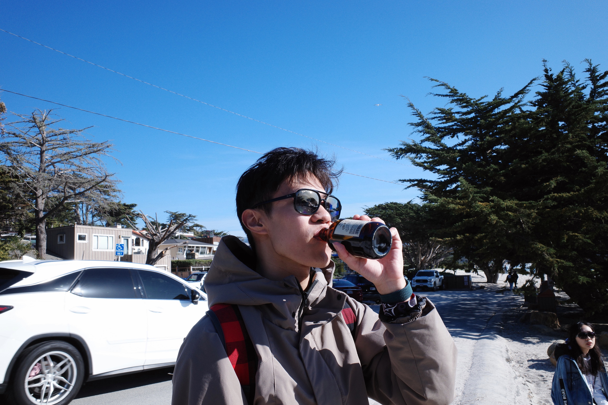

# Welcome to My Website! 👋
I'm based in Cambridge, MA.

I was born and raised in Nanjing, China. I graduated from Nanjing Foreign Language School in 2018, and I was an exchange student at Bishop Mcdevitt High School (which does not exist anymore 😢) in Wyncote, PA for 11th grade.

I'm a proud alum of [Vassar College](https://www.vassar.edu/) with a B.A degree in Economics and Mathematics & Statistics. (May 2022 🎓)

I'm pursuing a Master in Finance degree at Massachusetts Institute of Technology 🦫, with a concentration in financial engineering.

## Projects & Papers
As a typical liberal arts student, my academic interests span widely across fields. I've studied (mostly introductory level) philosophy, sociology, political science, cognitive science, computer science, music, and English. 

However, due to limited supply of time ⏰ and excessive demand of sleep 
😴 and leisure 🏖️, I've decided to focus on the intersection of statistics, economics, and finance. 

Below is a list of my relevant projects.

- Senior Thesis (2022), [Does Speculation Make Commodity Spot Markets More Volatile? An empirical approach testing the Masters hypothesis with new evidence](https://digitallibrary.vassar.edu/collections/institutional-repository/b778c6cd-005a-4db7-8722-dc0c6643ea42): winner of the [Agnes Reynold Jackson Prize](https://www.vassar.edu/economics/courses-and-requirements/prizes-and-honors#:~:text=The%20Agnes%20Reynolds%20Jackson%20Prize,the%20best%20senior%20seminar%20paper.) for best thesis in economics

- Cao, Y. and Hu, J. (2022), [Privacy protection for youth risk behavior using Bayesian data synthesis: a case study to the YRBS](https://pages.vassar.edu/jihu/files/2022/09/PSD2022_CaoHu_website.pdf), Privacy in Statistical Databases e-proceedings: an application of the synthetic data approach using Bayesian non-parametric models 
  
- [Ford Scholarship](https://www.vassar.edu/ford-scholars) (2020), [Redistribution or Illusion? –A closer look at Ecuador’s Economic Policies during Correa’s Citizen Revolution](https://pages.vassar.edu/fordscholars/author/ycao/): mainly involves the replication and calibration of a dynamic stochastic general equilibrium (DSGE) model  

## Competitive Debate and Speech
I've been in the college debating circuit since 2018. I have done BP for 4 years and APDA for 2 years. Below is a non-exhaustive list of my debating, judging, and debate organization experience:
- Member, MIT Debate Society (2022 - )
- Harvard APDA 2023: Barvardheimer
- Wellesley APDA: CROSSWORDS
- UChicago APDA: The Bachelor in Midwestern Paradise
- President, Vassar Debate Society (2020 - 2022)
- Chief Adjudicator, Vassar Invitational APDA Tournament (2021 and 2022)
- World Universities Debating Championship 2021, South Korea
- World Universities Debating Championship 2020, Thailand
- Vice President, Vassar Debate Society (2019 - 2020)
- BP Intervarsity Tournaments: Oxford IV, Yale IV, Cornell Tournament of Love, Brandeis IV, HWS IV, Hart House IV, Bard IV
  
## Contact
Connect with me on [LinkedIn](https://www.linkedin.com/in/yixiao-cao-441ab9160/) to stay updated on my professional journey.
